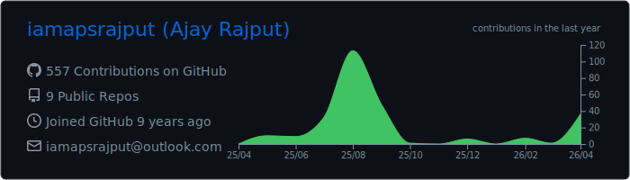
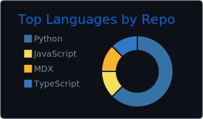
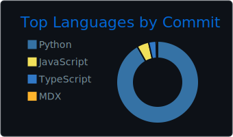
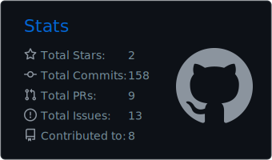

<!--
 Ajay Rajput — Portfolio GitHub Profile
 Enhanced with dynamic widgets & workflows
 Theme: Neon Radical + clean typography
-->

<!-- HEADER -->

---

## ⚡ About Me

Lead **Site Reliability Engineer @ Thomson Reuters** | 12+ years in **DevOps, Cloud, and AI systems**.  
I build **cloud-native, observable, and cost-aware platforms** with automation-first engineering.

✨ Areas of focus:  
- ☸️ **Cloud Infra**: AWS · Azure · Kubernetes · Terraform  
- ⚙️ **CI/CD & Automation**: GitHub Actions · Jenkins · Azure DevOps  
- 📈 **Observability by default**: Datadog · Grafana · Prometheus · ELK  
- 🔒 **Enterprise Security**: IAM · RBAC · Vault · Audit logging  
- 🤖 **AI × DevOps**: Routing, cost guardrails, intelligent automation  

---

## 🛠 Toolbox

  

---

## 🔭 Featured Work

### 🧠 <a href="https://github.com/iamapsrajput/modelmuxer">ModelMuxer</a> — Enterprise LLM Router  
Sub-200ms routing, cost guardrails (70% savings), multi-provider AI, K8s-native deployment.

### 🛠 GCC Control Plane — Thomson Reuters (2024)  
Infra + CI/CD for global ops dashboard. Automated incident handling for 1k+ alerts/day. Cut monitoring overhead by 70%.

### 🛰 FlightHub Optimization — Collins Aerospace (2020–22)  
Scaled **200+ microservices**, 2M+ events/day observability, infra cost ↓25% with autoscaling.

---

## 📊 My GitHub Stats

---

## 📈 Contributions Activity

<!-- Activity Graph -->

<!-- Contribution Snake (auto-generated to 'output' branch by workflow) -->

---

## 🏆 Achievements & Trophies

  

---

## 📌 Pinned Highlights

  
  

---

## 🗂 Profile Summary Cards (Auto-Generated)

  <!-- These files will appear after the workflow generates them daily -->
  
  
  
  

---

## 🧩 Metrics Dashboard (Auto-Generated)

  <!-- This file will be generated by the Metrics workflow -->
  

---

## ✨ Recognition

- 🏅 **Innovation Award 2025** – Thomson Reuters  
- 🌟 **Star Awards 2021** – Collins Aerospace  
- 🤝 **QUADRANT Award 2020** – Team Excellence  

“Be the change that you want to see in the world.”

