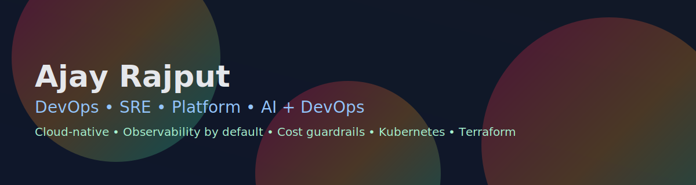

<!-- Ajay Rajput — Portfolio README (Radical) -->

  

<!-- Typing intro (separate element; GitHub does not allow z-index layering) -->

  

  
  
  
  

  
  
  

---

## 🔴 Now

- Building **ModelMuxer** (enterprise LLM router): routing policies, budget
  guardrails, K8s-native deploys
- Advancing **ShagunIntelligence**: agents, risk controls, orchestration
- Polishing **Vanipost** and docs

---

## 🚀 What I Do

I design and run **resilient, observable, cost-aware platforms** with **IaC,
CI/CD, security, and SLOs** baked in.

- ☸️ **Cloud Infra:** AWS · Azure · Kubernetes · Terraform
- ⚙️ **Automation:** GitHub Actions · Jenkins · Azure DevOps
- 📈 **Observability:** Datadog · Grafana · Prometheus · ELK
- 🔒 **Security:** IAM · RBAC · Vault · audit logging
- 🤖 **AI × DevOps:** LLM routing & guardrails

---

## 🧰 Toolbox

  

---

## 📌 Project Highlights (GitHub)

### 🧠 ModelMuxer — Enterprise LLM Routing Platform

**Repo:**
<a href="https://github.com/iamapsrajput/modelmuxer">github.com/iamapsrajput/modelmuxer</a>
**What it solves:** Routes each request to the **best model for cost, quality,
and latency**. **Highlights:**

- Heuristic/semantic/hybrid routing strategies
- **Budget guardrails** + usage analytics
- Multi-provider support (plug-in design)
- Kubernetes-native; observability by default **Stack:** FastAPI • Python • K8s
  • Prometheus/Grafana

---

### 📈 ShagunIntelligence — AI Trading Platform (India, Intraday)

**Repo:**
<a href="https://github.com/iamapsrajput/shagunintelligence">github.com/iamapsrajput/shagunintelligence</a>
**What it solves:** Modular **agentic** research → decision → execution with
**risk controls**. **Highlights:**

- Zerodha Kite API integration (paper/live modes)
- Orchestration & guardrails; kill-switches and limits
- Microservices-first; contracts & observability baked in **Stack:** Python •
  FastAPI • Task orchestration • Docker/K8s

---

### ✍️ Vanipost — Minimal Publishing Playground

**Repo:**
<a href="https://github.com/iamapsrajput/vanipost">github.com/iamapsrajput/vanipost</a>
**What it solves:** Lightweight, developer-friendly posting with simple
workflow. **Highlights:**

- Markdown-first content flow
- Straightforward deploy (ideal for GitHub Pages)
- Clean, minimal UX **Stack:** (lightweight) Markdown • Static hosting

---

## 📊 Live Stats

  
  
  

## 📈 Activity

  
  

## 🗂 Profile Summary Cards (Auto)

  
  
  
  

## 🧩 Metrics Dashboard (Auto)

---

## ✨ Recognition

- 🏅 Innovation Award 2025 — Thomson Reuters
- 🌟 Star Awards 2021 — Collins Aerospace
- 🤝 QUADRANT Award 2020 — Team Excellence

“Be the change that you want to see in the world.”

