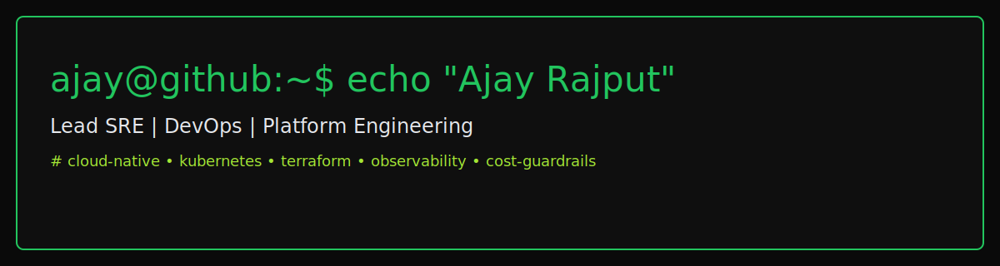

<!-- Ajay Rajput — Minimal Terminal Theme -->

  

  <a href="https://ajayrajput.link">Website</a> •
  <a href="mailto:iamapsrajput@outlook.com">Email</a> •
  <a href="https://www.linkedin.com/in/iamapsrajput/">LinkedIn</a> •
  <a href="https://github.com/iamapsrajput">GitHub</a>

### $ whoami
Lead SRE / DevOps / Platform Engineering. I build cloud‑native, observable, cost‑aware systems.

### $ now
- ModelMuxer: routing policies, budgets, K8s
- AI × Ops notes + experiments
- Observability defaults across repos

### $ stack
AWS Azure K8s Terraform • GitHub Actions • Python Bash • Datadog Grafana Prometheus

### $ stats

### $ activity

### $ snake

### $ recognition
Innovation Award 2025 • Star Awards 2021 • QUADRANT 2020
